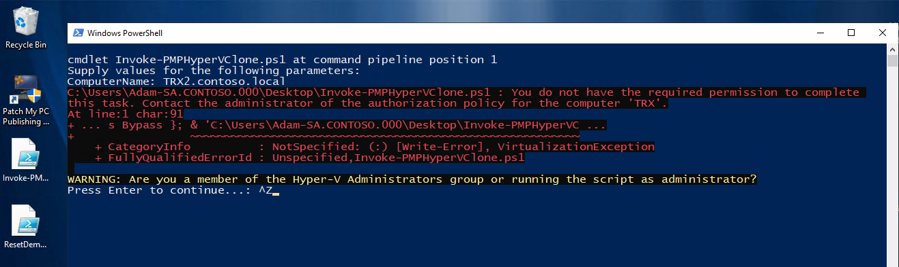

# PMPHyperVClone

PowerShell script to clone Hyper-V VMs from one host to another.

When invoked, you will asked which VMs (locally) you would like to clone from a multi-selection Out-GridView window.

You will then be asked which volume on the host specified for `-ComputerName` you would like to store these VMs from another Out-GridView window.

You can choose drive letter but you cannot choose folder. The VMs will always be stored in a folder at the root of the volume named "VMs". For example, choosing the "D" volume will store the VMs in `D:\VMs` on the target host. 

If a folder exists on the target host with the same name as the VM(s) you're cloning, the script will skip the VM. You must delete or rename the folder on the target host. This is to prevent accidental clobbering.

If VMs are running, you will be asked if you want to shut them down. Not necessary but it is recommended.

## Requirements

- SYSTEM account of source host must be local admin on target host: VMMS service runs as SYSTEM by default and that's used for Export-VM. 
    - This could be negated by exporting locally first, then copy to target host
- Invoking user be in the Hyper-V Administrators group on the source host or execute the script as administrator / elevated

